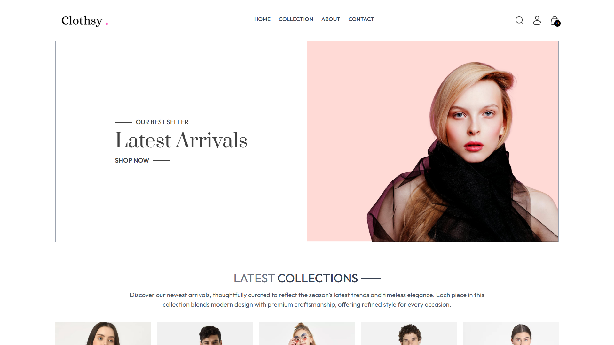

# 🛍️ Clothy - Modern E-Commerce Website

Clothy is a modern and stylish e-commerce website built using the **MERN Stack**. It features a clean user interface for shopping, browsing collections, and a powerful admin dashboard to manage products, users, and orders.

---

## 🚀 Explore Live Projects

- 🛍️ [Shop Frontend](https://e-commercefrontend-omega.vercel.app/)
- 🧑‍💼 [Admin Dashboard](https://e-commerceadmin-ivory.vercel.app/)

---

## 🔧 Tech Stack

- **Frontend**: React, Tailwind CSS
- **Backend**: Node.js, Express.js
- **Database**: MongoDB
- **Admin Panel**: React + Tailwind-based Dashboard

---

## 📦 Features

- **Product Catalog & Filters**: Browse a wide range of products with category-based filtering and sorting options.
- **Add to Cart & Checkout**: Seamless shopping cart experience with a smooth and secure checkout process.
- **User Authentication**: Users can register, log in, and manage their profiles securely.
- **Admin Dashboard**: Admins can manage products, users, and orders efficiently from a dedicated panel.
- **Responsive Design**: Fully responsive layout ensuring a great user experience across all devices.

